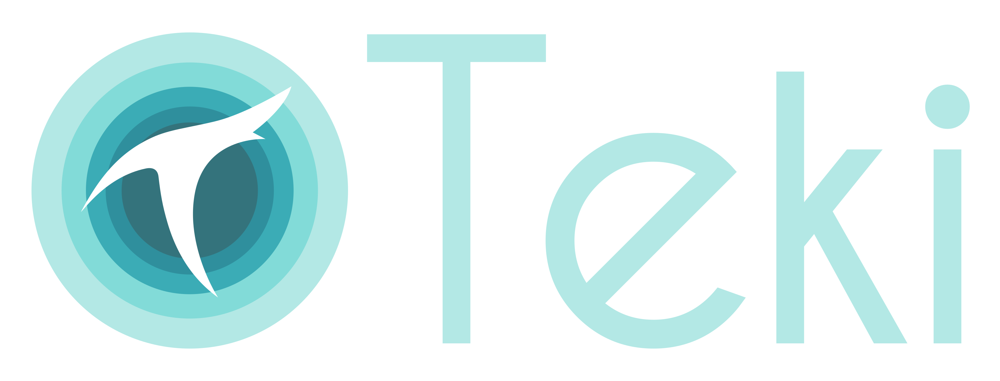

# Teki

>"The most important parts of any project are a cool name and a logo." - literally no one.

Teki is my Vulkan-based toy-renderer. It is my primary environment for experimenting with real-time rendering techniques and general programming as well. 
### Renderer feature list
* [Forward+ rendering](docs/clustering.md)  
* [PBR rendering](docs/pbr.md)  
* [HBAO](docs/hbao.md)  
* [Frustum culling](docs/frustum_culling.md)  
* FXAA
* Bindless textures  
* Reverse-Z  
### Core feature list
* Buffer suballocation
* Descriptor buffers
* HDR cubemap support
