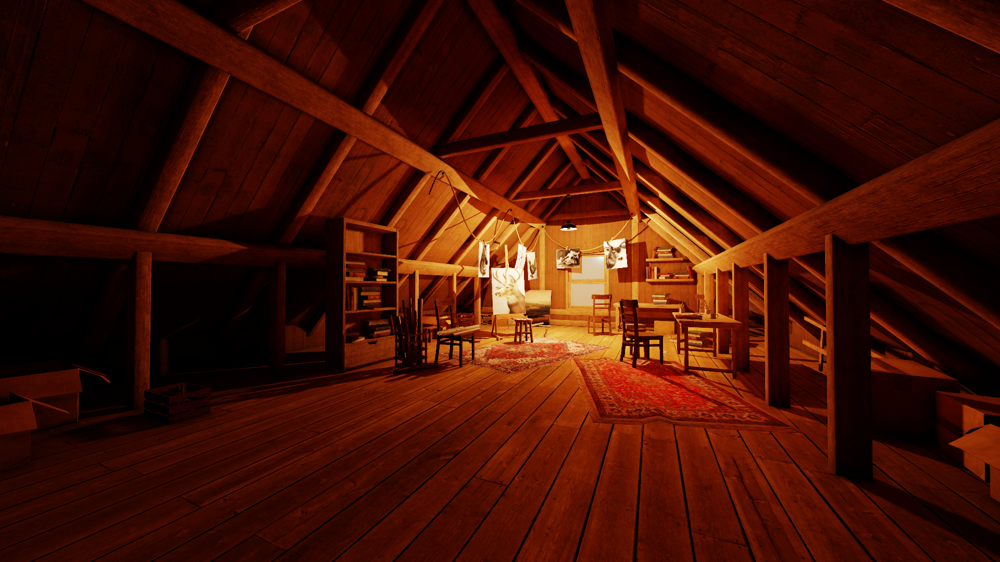

# Teki

Teki is a Vulkan-based toy-renderer. It is my primary environment for experimenting with real-time rendering techniques and general programming as well.

### Renderer feature list

* [Global Illumination - Software Ray-Traced Diffuse and Specular](docs/gi.md)
* [Light clustering](docs/clustering.md)
* [Deferred rendering (texturing) - UV-buffer](docs/deferred.md)
* [PBR](docs/pbr.md)
* [Shadow mapping for Spot and Point lights - PCSS, PCF](docs/shadows.md)
* [Hi-Z occlusion culling](docs/occlusion_culling.md)
* TAA
* HBAO
* Bindless materials
* HDR pipeline
* Reverse-Z
* Frustum culling
* Tonemapping

### Core feature list

* Buffer suballocation
* Descriptor buffers
* Asynchronous compute queue
* Parallel command buffer recording
* Block compressed textures support (ktx2)
* HDR cubemap support
   
Everything is developed and tested on my GTX 1050 Ti.

#### Examples  

###### Credit: [Attic](https://sketchfab.com/3d-models/the-attic-environment-9b97eaaa74fc409a9344509af68f0590), [Sponza](https://www.intel.com/content/www/us/en/developer/topic-technology/graphics-research/samples.html), [Bathroom](https://sketchfab.com/3d-models/the-bathroom-free-d5e5035dda434b8d9beaa7271f1c85fc), [Town](https://sketchfab.com/3d-models/stylized-little-japanese-town-street-200fc33b8a2b4da98e71590feeb255a8), [Helmet](https://github.com/KhronosGroup/glTF-Sample-Assets/tree/main/Models/DamagedHelmet).
