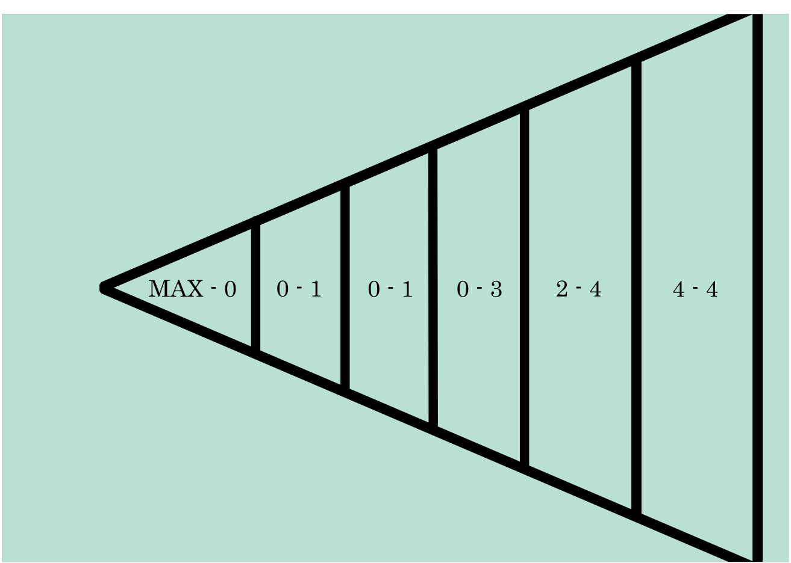

## Teki's light clustering  

Teki uses light culling algorithm described in [this](https://www.activision.com/cdn/research/2017_Sig_Improved_Culling_final.pdf) Call of Duty presentation.  

#### Example from the renderer  

#### Brief overview of the algorithm.
1. Lights are culled against the view frustum.

2. Remaining lights are sorted by their depth to the camera.

3. Frustum is divided by depth into multiple bins. For each bin the closest and furthest lights to the camera contained in it are found.

4. Lights' bounding volumes are rasterized to reduced viewport(width/8, height/8) with MSAA. Fragment shader writes to the corresponding bit in the tile bit array.  
5. In the main fragment shader, each invocation accesses corresponding bin via linear depth and gets min and max light indices. Then it gets tile bit array using screen coordinates.
  
To avoid diverging in the fragment shader we scalarize the loop traversal by doing subgroup operations on min and max indices and light bit arrays.
For example, if we assume that all **red** fragment invocations on the image above belong to the same subgroup, their min index would be **1** and max would be **4**,
subgroup operation on light bit array would give **10010111**. It means that only light **3** is calculated.
