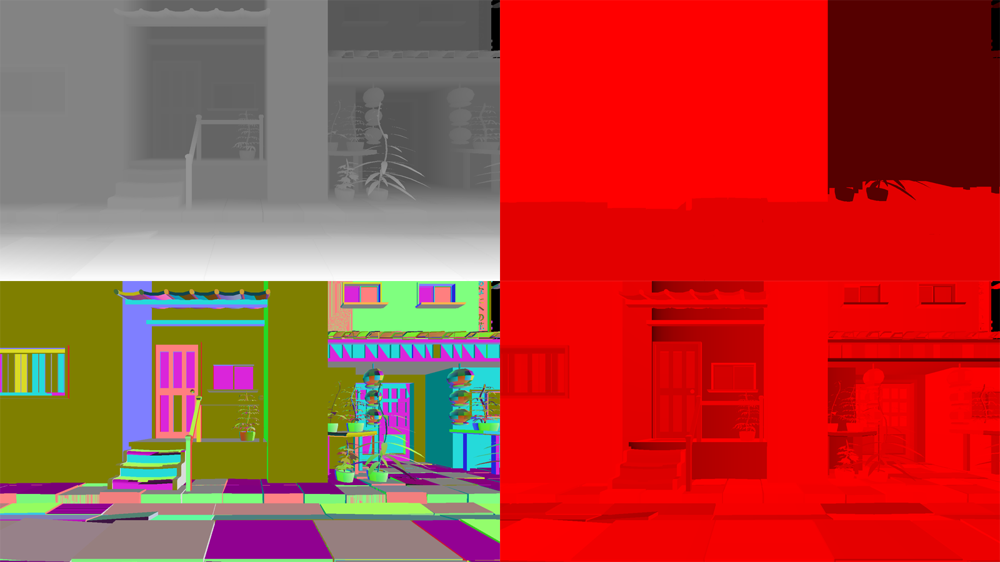

## Deferred rendering (UV-buffer)
  
###### Clockwise from the top left - depth, drawID with tangent frame bit, encoded texture UV, encoded tangent frame.  
   
#### Prepass      
Opaque geometry is rendered into multiple image-buffers.  
* Depth - depth(z-buffer) is used to retrieve world or view position.
* UV - texture coordinates, UV gradients for mip selection are computed from nearby values.
* DrawID - used to access materials.
* Packed tangent frame - used for normal mapping.   
#### Lighting pass   
Main screen-space pass.
#### Forward pass   
Pass for transparent geometry.

###### References: [[1]](https://advances.realtimerendering.com/s2015/aaltonenhaar_siggraph2015_combined_final_footer_220dpi.pdf) [[2]](https://therealmjp.github.io/posts/bindless-texturing-for-deferred-rendering-and-decals/)
