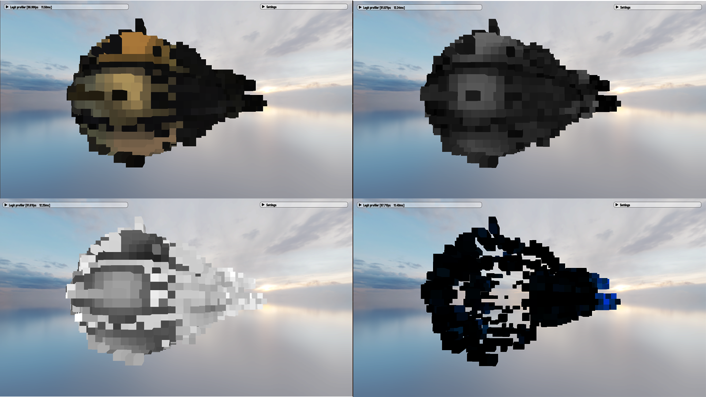
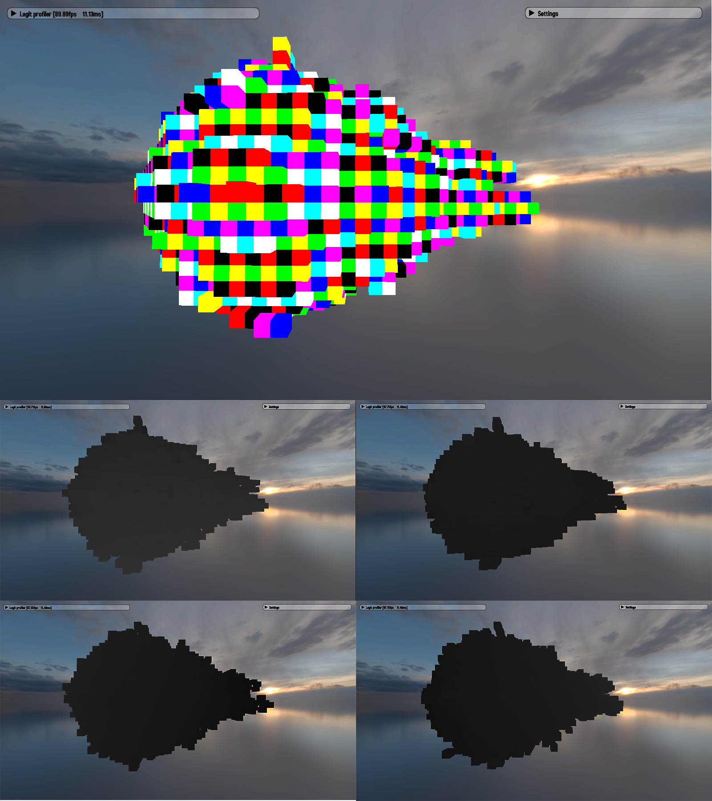
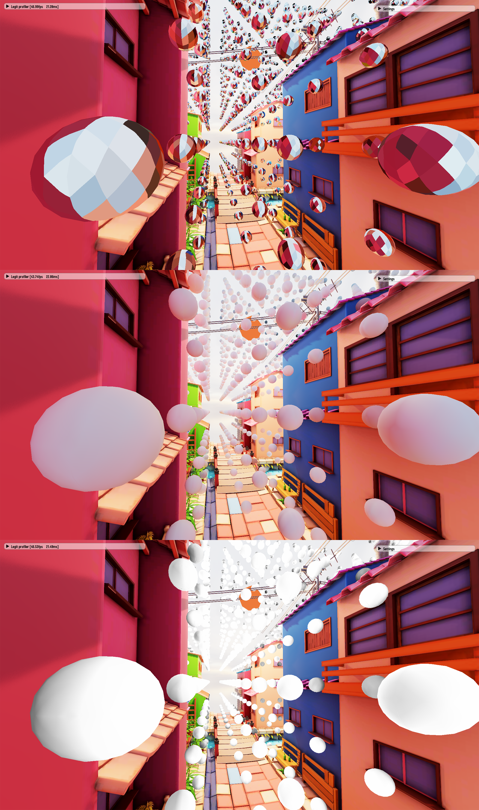

# Global Illumination  
  

|  |
| :---: | 

Global illumination system in Teki separates direct and indirect lighting.  

Direct lighting technique is described [here](clustering.md).  
Indirect lighting is based on ROMA[^1] and DDGI[^2][^3] and inspired by SDFGI[^4].

|  |
| :---: | 
| *Figure 2. Picture is a link to the Youtube video showcasing essential GI structures.* |

Firstly, we construct voxelized version of the scene.

|  |
| :---: | 
| *Figure 3. Top left - albedo, top right - metalness, bottom left - roughness, bottom right - emission.* |

When voxelizing the scene we also create Base Occupancy Map (BOM)[^1].  
BOM is used to create Ray-aligned Occupancy Map (ROMA)[^1].

|  |
| :---: | 
| *Figure 4. BOM - on the top. Four ray-aligned occupancy maps - on the bottom. Direction of a ray-aligned occupancy map is visualized as a gradient.* |

Light injected into emission voxelmap through shadow maps.  

|  |
| :---: | 
| *Figure 5. Picture is a link to the Youtube video showcasing the light injection result.* |

After the scene representation is ready we can start tracing process.  
Probes are traced with snapped[^1] rays, whereas glossy reflection rays are not snapped.  
After radiance and hit distance are gathered, DDGI[^2] probes integrate irradiance and visibility.

|  |
| :---: | 
| *Figure 6. From top to bottom - radiance, irradiance, visibility.* |

###### Credit: [Sci-Fi Pod Ship](https://sketchfab.com/3d-models/sci-fi-personal-space-pod-shipweekly-challenge-b158f01dd4a9416fb689ca4401856e7a), [Stylized Little Japanese Town Street](https://sketchfab.com/3d-models/stylized-little-japanese-town-street-200fc33b8a2b4da98e71590feeb255a8), [Stylized Pirate Island](https://sketchfab.com/3d-models/stylised-pirate-island-97146d4981754203b91e6ca83543f2ba).

[^1]:(https://zheng95z.github.io/publications/roma23)
[^2]:(https://www.jcgt.org/published/0008/02/01/paper-lowres.pdf)
[^3]:(https://jcgt.org/published/0010/02/01/paper-lowres.pdf)
[^4]:(https://www.docdroid.net/ILIv1Qj/godot-sdfgi-plan-for-41-pdf)
