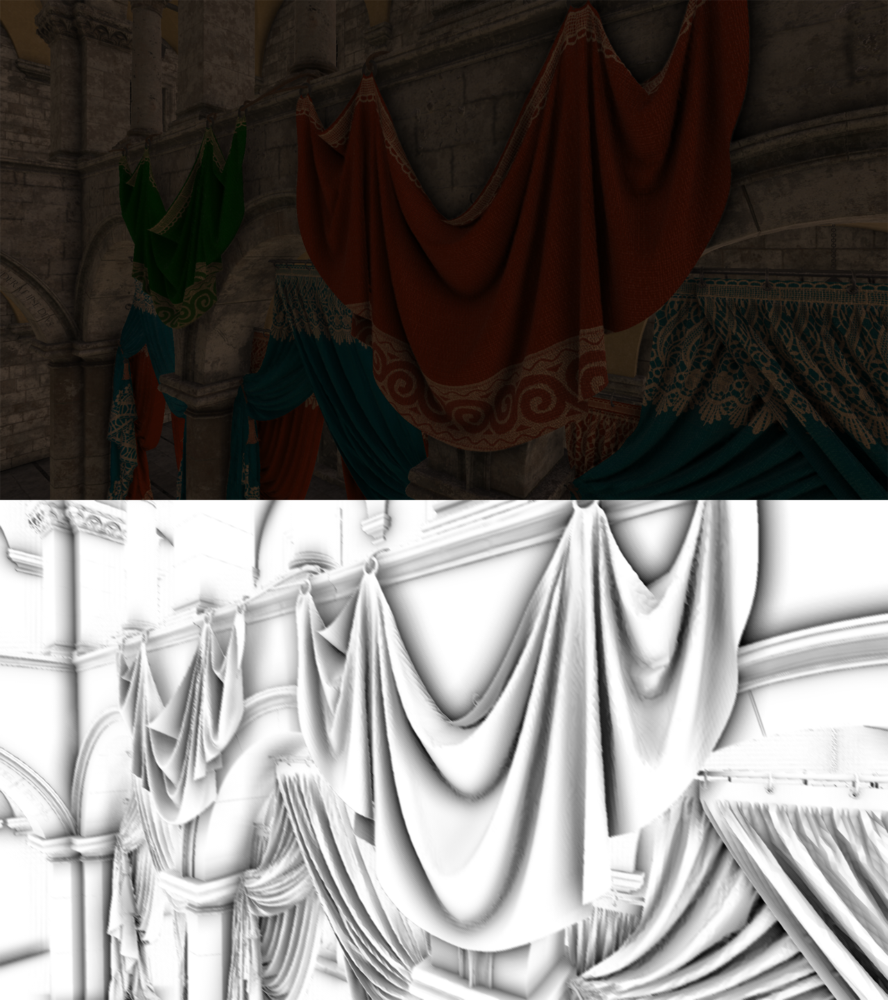

## HBAO  
  
###### Credit: [Intel Corporation](https://www.intel.com/content/www/us/en/developer/topic-technology/graphics-research/samples.html)

* Scene's linear depth is rendered into a color attachment. Expanded frustum FOV is used to avoid edge artifacts
* In the main pass normals are reconstructed from depth and then occlusion calculation starts with sampling vectors rotated and scaled by values from pregenerated random texture
* Edge preserving blur is used on the final image
