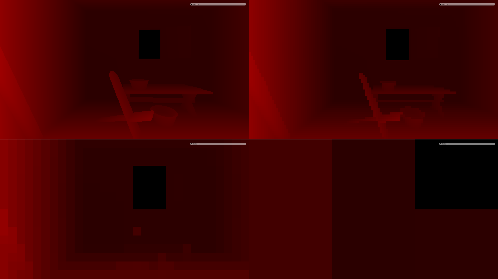
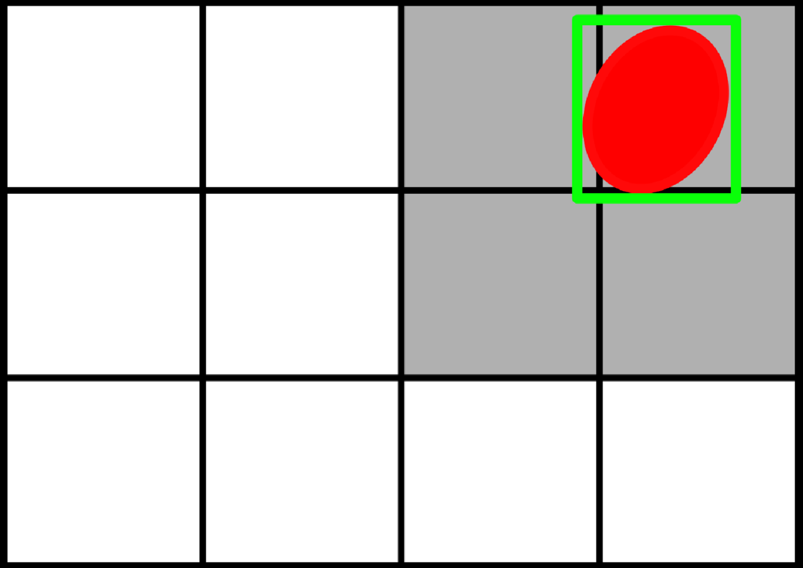

## Occlusion culling  

Two-phase occlusion culling technique is used.  
* Bounding sphere of a mesh (previosly culled by frustum) is projected onto the screen.  
* Appropriate level of last frame Hi-Z pyramid is sampled to find minimal depth in the area.
* If the minimal depth is smaller than the sphere's depth, mesh is culled.  

###### [Awesome article on Hi-Z and occlusion culling](https://www.rastergrid.com/blog/2010/10/hierarchical-z-map-based-occlusion-culling/)

###### Projected sphere is not a disk. Bounds are marked in green. Grey texels are sampled..
