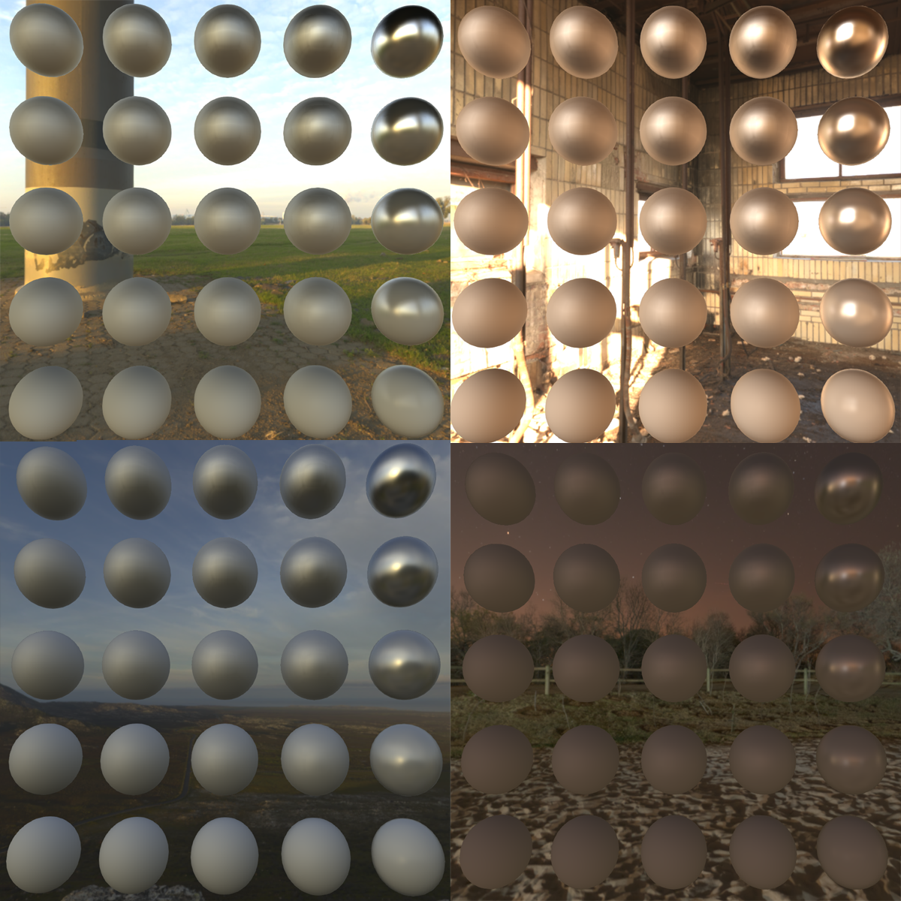
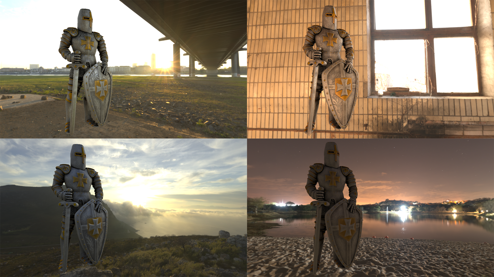
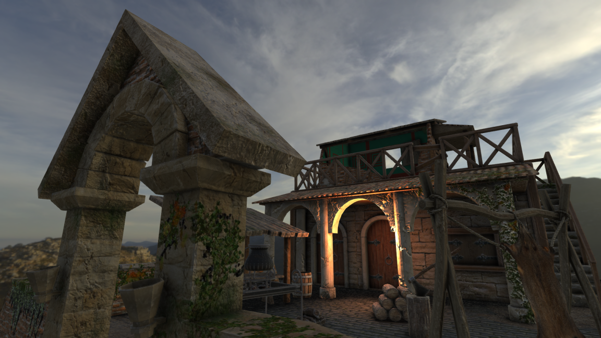

## PBR  
PBR in Teki is mostly based on the [2014 Frostbite paper](https://seblagarde.files.wordpress.com/2015/07/course_notes_moving_frostbite_to_pbr_v32.pdf). Additionally, multi-scattering technique described in 
[this](https://www.jcgt.org/published/0008/01/03/paper.pdf) paper is used.
  * Normalized Disney diffuse
  * Smith height-correlated visibility function
  * GGX normal distribution function  

  
  
###### Credit: [Andy Woodhead](https://sketchfab.com/Andywoodhead)
  
###### Credit: [Andy Woodhead](https://sketchfab.com/Andywoodhead)  

###### Cubemaps are made from HDRIs from [Poly Haven](https://polyhaven.com/hdris)
