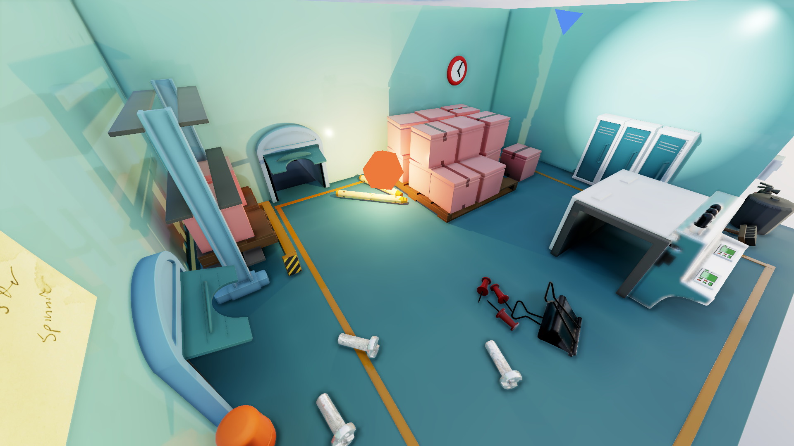
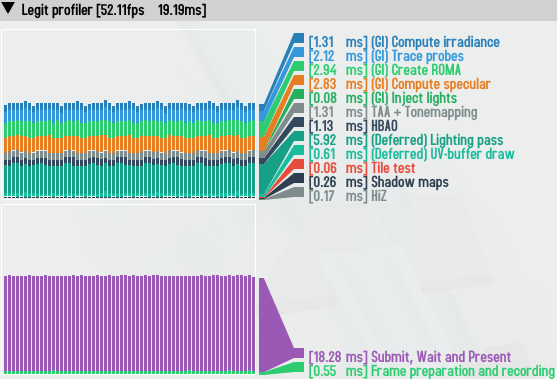
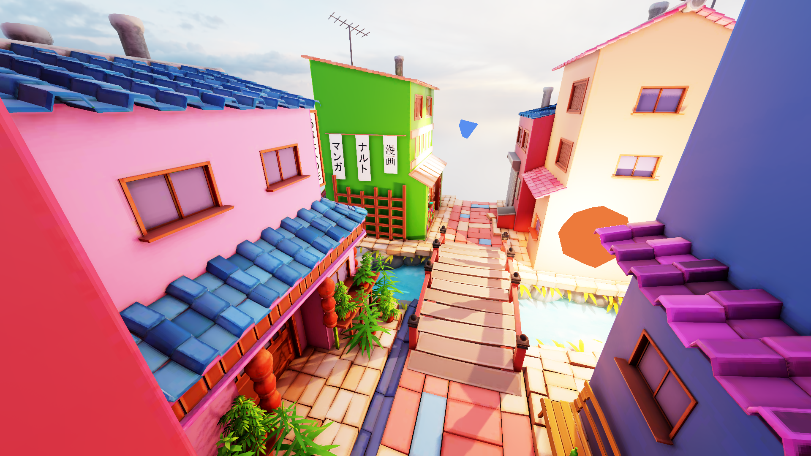
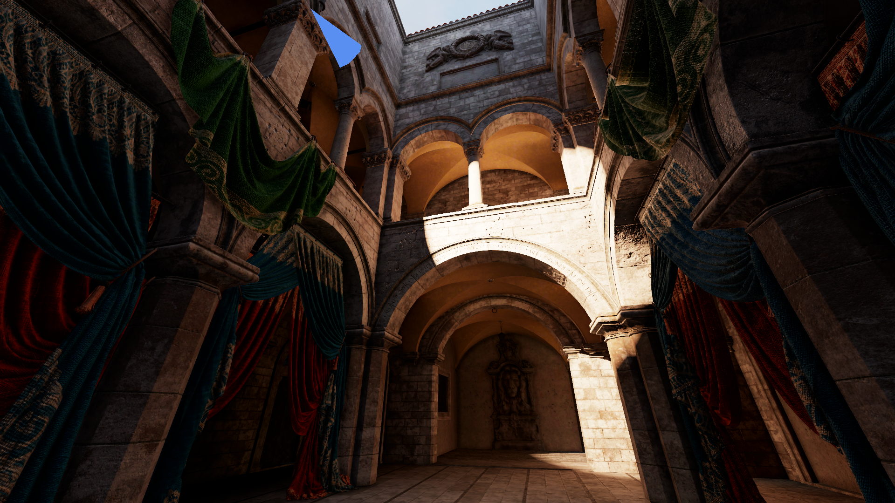
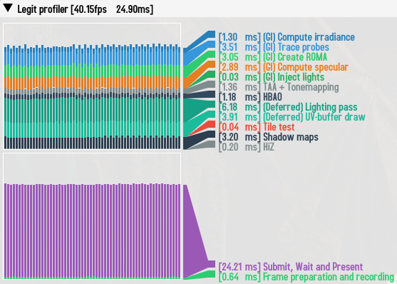

## Performance

Hardware:
* CPU - Intel Core i3-2130
* GPU - GTX 1050Ti

Constant scene setup:
- ROMA
  - Positional resolution - 128
  - Angular resolution - 32
- Irradiance probes
  - 24 * 24 * 24 probes (884 736 rays)
- Specular tracing
  - 960 * 540 screen-space trace (518 400 rays)
  - 128 max steps
- All lights cast shadows

Scene setup:
- Low triangle complexity
- Low geometry complexity[^1]
- Two lights (Spot and Point)
  
  

Scene setup:
- Medium triangle complexity
- Medium geometry complexity
- Two lights (Spot and Point)
  
  

Scene setup:
- High triangle complexity
- Medium geometry complexity
- One light (Spot)[^2]
  

###### Credit: [PICA Scene](https://sketchfab.com/3d-models/pica-pica-mini-diorama-01-45e26a4ea7874c15b91bd659e656e30d), [Stylized Little Japanese Town Street](https://sketchfab.com/3d-models/stylized-little-japanese-town-street-200fc33b8a2b4da98e71590feeb255a8), [Intel Sponza](https://www.intel.com/content/www/us/en/developer/topic-technology/graphics-research/samples.html).

[^1]: Geometry complexity affects specular tracing. It reduces amount of possible mip jumps.
[^2]: Omnidirectional shadow map takes too much time on Intel Sponza because of high polycount and spatial mesh density.
