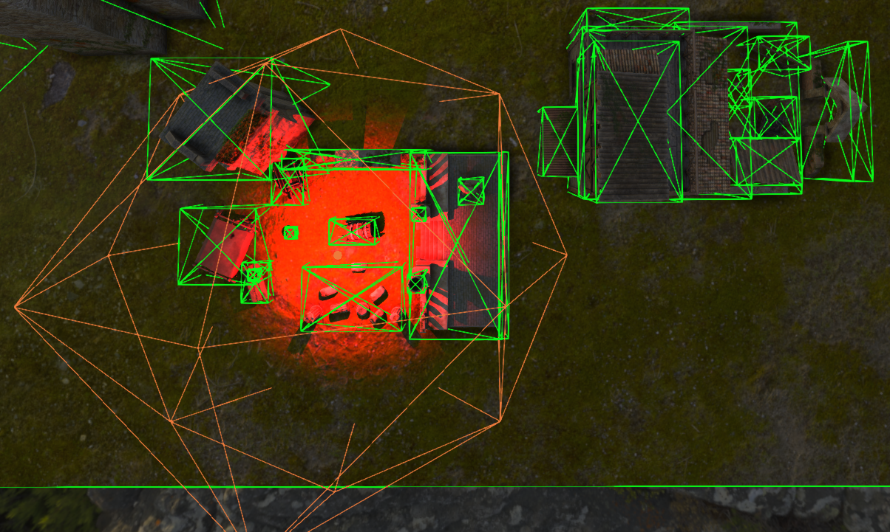

## Shadows

* Unidirectional and omnidirectional shadow mapping is present.
* If lights are not culled by frustum, their shadow maps are rendered.  
* If OBBs of the meshes do not intersect light's bounding sphere, these meshes are culled.  
* For soft shadows PCF is used.

###### Credit: [Andy Woodhead](https://sketchfab.com/Andywoodhead)
