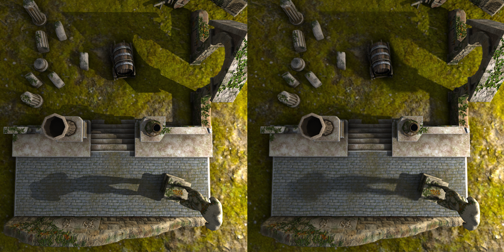

## Shadows

* Unidirectional and omnidirectional shadow mapping is present.
* If lights are not culled by frustum, their shadow map are rendered.  
* If OBBs of the meshes do not intersect light's bounding sphere, these meshes are culled.  

###### Credit: [Andy Woodhead](https://sketchfab.com/Andywoodhead)
* For soft shadows PCSS ([1](https://developer.download.nvidia.com/whitepapers/2008/PCSS_Integration.pdf), [2](https://developer.download.nvidia.com/shaderlibrary/docs/shadow_PCSS.pdf), [3](https://http.download.nvidia.com/developer/presentations/2005/SIGGRAPH/Percentage_Closer_Soft_Shadows.pdf)) is used.

###### PCSS requires a lot of tweaking, it is fairly noisy, a lot of cahce inefficent texture fetches made. Still, it looks really cute.
###### Credit: [Andy Woodhead](https://sketchfab.com/Andywoodhead)
